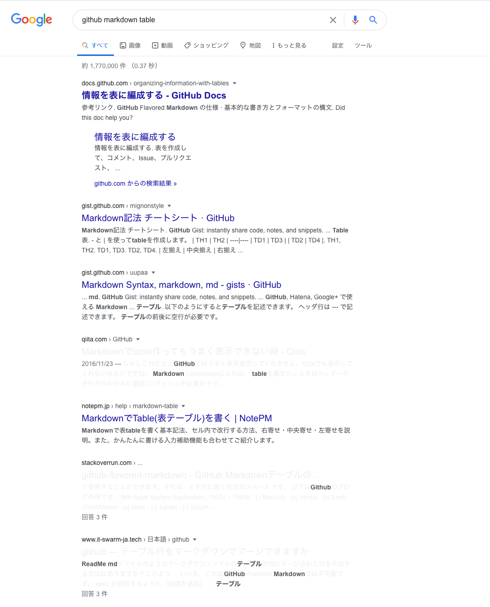
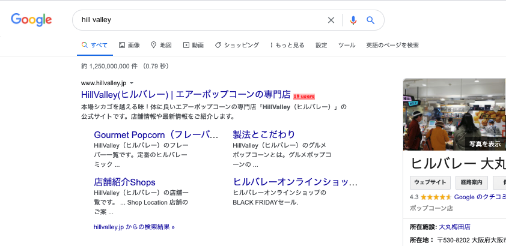
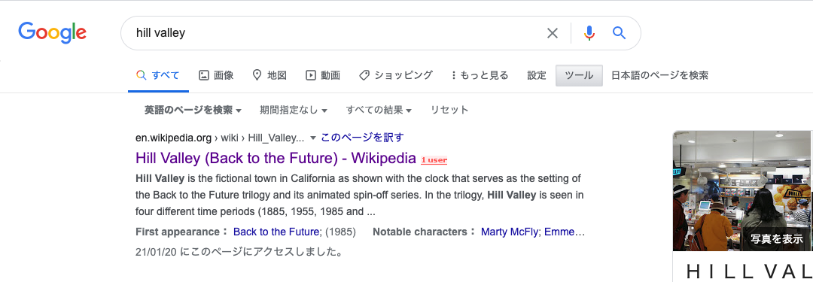
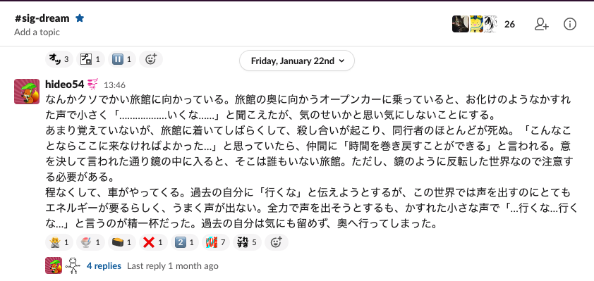
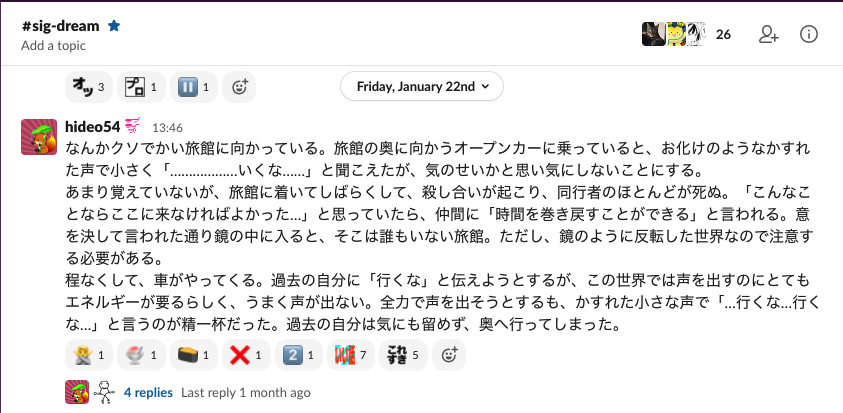
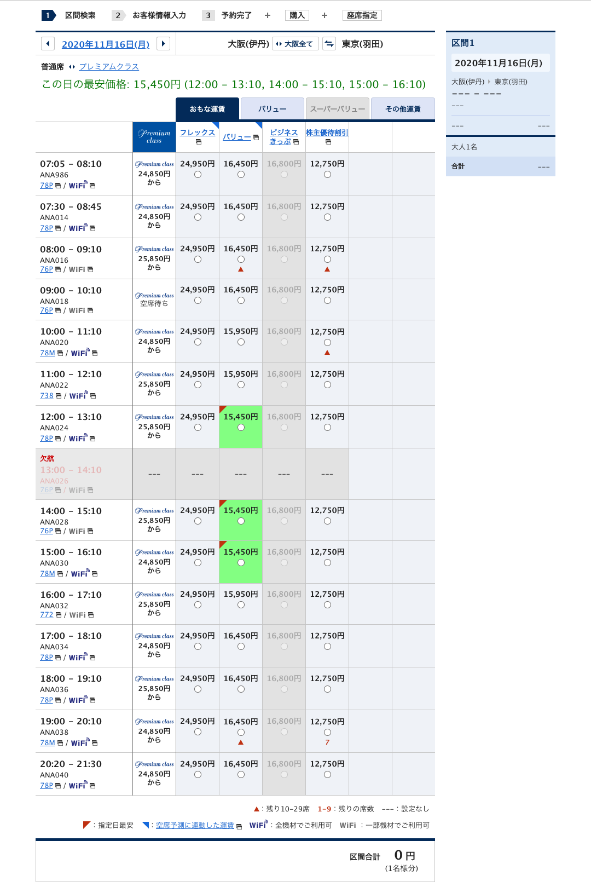
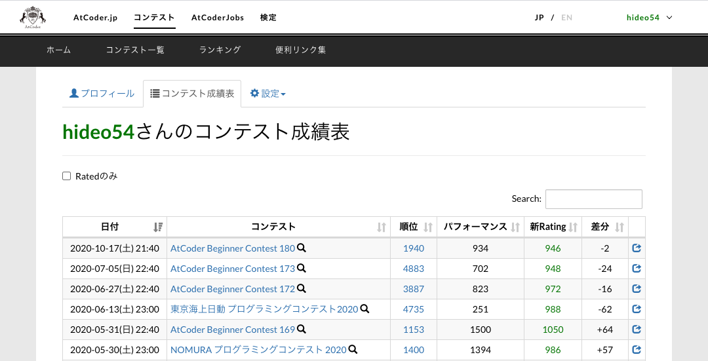

# userscripts

hideo54 が日常生活を便利にするために都度書いているカスタム JS, CSS の置き場です。自分用なので**何の責任も取りません。**

## 想定環境

* Google Chrome
* [Tampermonkey](https://chrome.google.com/webstore/detail/tampermonkey/dhdgffkkebhmkfjojejmpbldmpobfkfo) (for `.user.js`)
* [Stylus](https://chrome.google.com/webstore/detail/stylus/clngdbkpkpeebahjckkjfobafhncgmne) (for `.user.css`)

まあ他でもよさそう (しらんけど)

## 使い方

使いたい `.user.js` や `.user.css` を選択して "Raw" を押せば、Tampermonkey や Stylus が開くはずだよ。

## Gallery

お気に入り順。

### [Reliable Google Search](https://raw.githubusercontent.com/hideo54/userscripts/master/reliable-google-search.user.js)

Google 検索結果から、hideo54が名指しした好きなサイトの影を濃く、嫌いなサイトの影を薄くするよ。

| Before | After |
| --- | --- |
|  |  |

サイト (ドメインベース) は手動でちまちまアップデートしているよ。

### [English Search Button](https://raw.githubusercontent.com/hideo54/userscripts/master/english-search-button.user.js)

日本語 Google の検索言語ボタンはデフォルトでは「すべての言語」「日本語のページを検索」しかないから、「英語のページを検索」ボタンを追加するよ。

### [Big Emoji on Slack Web](https://raw.githubusercontent.com/hideo54/userscripts/master/big-emoji-on-slack-web.user.css)

Slack Web の reaction の絵文字を大きく表示するよ。

| Before | After |
| --- | --- |
|  |  |

### [Our Beautiful Hongo](https://raw.githubusercontent.com/hideo54/userscripts/master/our-beautiful-hongo.user.css)

東大の諸々のログイン画面の安田講堂を縦ディスプレイでも綺麗に映すよ。

| Before | After |
| --- | --- |
|  |  |

### [Copy Block Blocker](https://raw.githubusercontent.com/hideo54/userscripts/master/copy-block-blocker.user.css)

コピー禁止を無効化するよ。コピー禁止コンテンツを見つけ次第どんどん足していくよ。

### [ANA Cheapest Flight](https://raw.githubusercontent.com/hideo54/userscripts/master/ana-cheapest-flight.user.js)

ANA の区間検索画面で最安フライトを強調表示するよ。

| Before | After |
| --- | --- |
|  |  |

### [AtCoder performance colorizer](https://raw.githubusercontent.com/hideo54/userscripts/master/atcoder-performance-colorizer.user.js)

AtCoder の「コンテスト成績表」画面で、「パフォーマンス」の数字にも「新Rating」同等の色付けをするよ。

| Before | After |
| --- | --- |
|  |  |

### [List list for Twitter](https://raw.githubusercontent.com/hideo54/userscripts/master/list-list-for-twitter.user.js)

Twitter Web でユーザのプロフィールやツイートを表示させた時に、その人の所属しているリスト一覧を表示するよ。

beta版。不安定。あんま丁寧に作ってない。注意。自己責任。要認証情報。

| Before | After |
| --- | --- |
|  |  |
