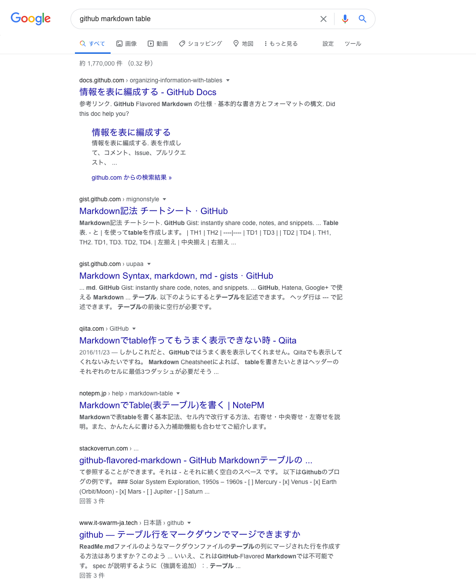
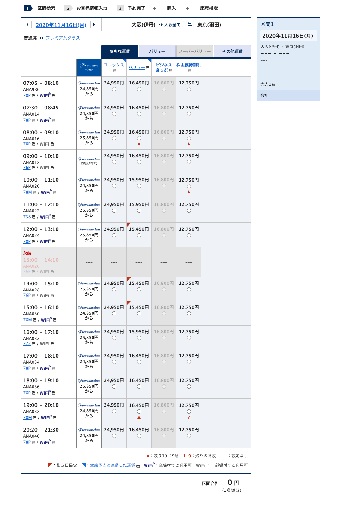
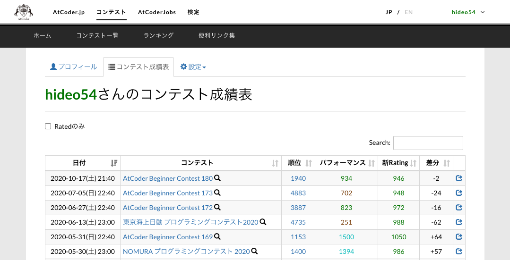
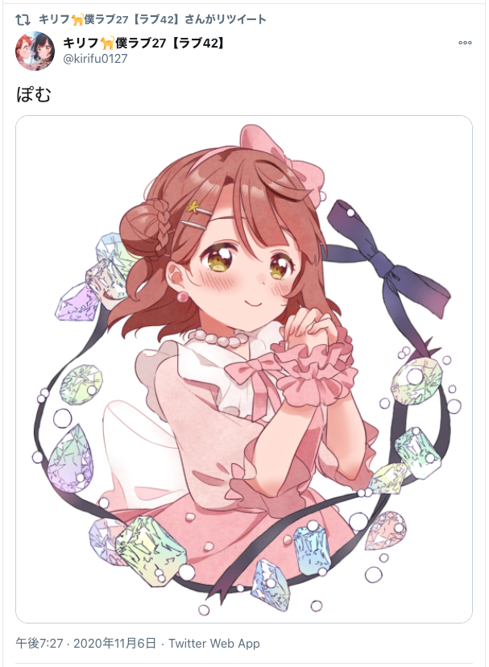
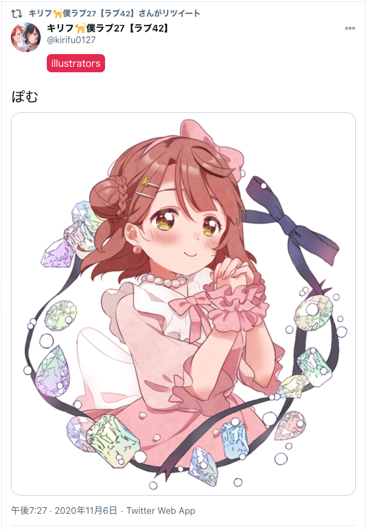

# userscripts

hideo54 が日常生活を便利にするために都度書いた userscripts 置き場だよ。**何の責任も取らないよ。**

## 使い方

使いたい `.user.js` を選択して "Raw" を押せば、Tampermonkey が開くはずだよ。

## Gallery

### Reliable Google Search

Google 検索結果から、hideo54が名指しした好きなサイトの影を濃く、嫌いなサイトの影を薄くするよ。

| Before | After |
| --- | --- |
|  |  |

サイト (ドメインベース) は手動でちまちまアップデートしているよ。

### ANA Cheapest Flight

ANA の区間検索画面で最安フライトを強調表示するよ。

| Before | After |
| --- | --- |
|  |  |

### AtCoder performance colorizer

AtCoder の「コンテスト成績表」画面で、「パフォーマンス」の数字にも「新Rating」同等の色付けをするよ。

| Before | After |
| --- | --- |
|  |  |

### List list for Twitter

Twitter Web でユーザのプロフィールやツイートを表示させた時に、その人の所属しているリスト一覧を表示するよ。

beta版。不安定。あんま丁寧に作ってない。注意。自己責任。要認証情報。

| Before | After |
| --- | --- |
|  |  |
